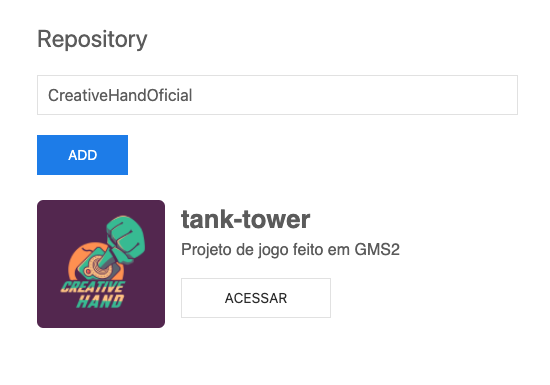

<h1 align="center">
    
</h1>

<p align="center">
 <a href="#-sobre-o-projeto">Sobre</a> •
 <a href="#-funcionalidades">Funcionalidades</a> •
 <a href="#-como-executar-o-projeto">Como executar</a> • 
 <a href="#-tecnologias">Tecnologias</a> •  
 <a href="#-autor">Autor</a> • 
 <a href="#user-content--licença">Licença</a>
</p>


## 💻 Sobre o projeto

O Es6 Study foi criando para estudar a features de ES6/7/8 do cursor starter da [Rockseat](https://rocketseat.com.br/).

---

## 🚀 Como executar o projeto

1. Frontend (pasta src)

### Pré-requisitos

- [Git](https://git-scm.com)
- [Node.js](https://nodejs.org/en/)
- [Yarn](https://yarnpkg.com/) or [NPM](https://www.npmjs.com/)


#### Rodando a aplicação web (Frontend)

```bash

# Clone este repositório
$ git clone https://github.com/rbarbosa95/es6-study

# Acesse a pasta do projeto no seu terminal/cmd
$ cd est-study

# Instale as dependências
$ yarn

# Execute a aplicação em modo de desenvolvimento
$ yarn dev

# A aplicação será aberta na porta:8080 - acesse http://localhost:8080

```
> 💡 Caso já tenha um projeto rodando na 8080 ele rodará na próxinma disponivel. 

---

## 🛠 Tecnologias

As seguintes ferramentas foram usadas na construção do projeto:

- [Node.js](https://nodejs.org/en/)
- [Javascript](https://developer.mozilla.org/pt-BR/docs/Web/JavaScript)
- [webpack](https://webpack.js.org/)

> Para mais detalhes acesse o package.json

---

## 👨🏽‍💻 Autor

<div align="left">
<table>
  <tr align="center">
    <td>Coded By</td>
  </tr>
  <tr align="center">
    <td>
      <a href="https://github.com/rbarbosa95">
        
      </a>
    </td>
  </tr>
</table>
</div>

---

## 📝 Licença

Este projeto esta sobe a licença [MIT](./LICENSE).

Feito com 💚 por [Ramon Barbosa](https://www.linkedin.com/in/ramon-guimaraes/)

---
